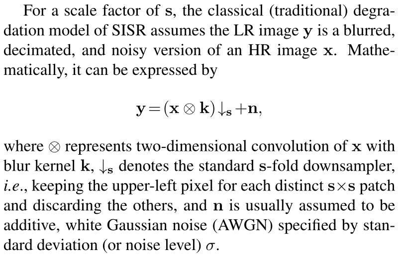
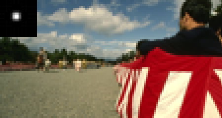
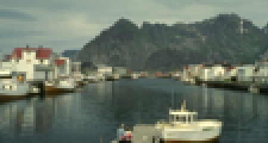

# [Deep unfolding network for image super-resolution](https://arxiv.org/pdf/2003.10428.pdf)
Kai Zhang, [Luc Van Gool](https://vision.ee.ethz.ch/people-details.OTAyMzM=.TGlzdC8zMjQ4LC0xOTcxNDY1MTc4.html), [Radu Timofte](http://people.ee.ethz.ch/~timofter/)  
_[Computer Vision Lab](https://vision.ee.ethz.ch/the-institute.html), ETH Zurich, Switzerland_

[[Paper](https://arxiv.org/pdf/2003.10428.pdf)]

___________

* [Classical SISR degradation model](#classical-sisr-degradation-model)
* [Motivation](#motivation)
* [Unfolding algorithm](#unfolding-algorithm)
* [Deep unfolding SR network](#deep-unfolding-sr-network)
* [Models](#models)
* [Codes](#codes)
* [Blur kernels](#blur-kernels)
* [Approximated bicubic kernel under classical SR degradation model assumption](#approximated-bicubic-kernel-under-classical-sr-degradation-model-assumption)
* [PSNR results](#psnr-results)
* [Visual results of USRGAN](#visual-results-of-usrgan)
* [Results on bicubicly degradated LR images](#results-on-bicubicly-degradated-lr-images)
* [Generalizability](#generalizability)
* [Real image SR](#real-image-sr)
* [Citation](#citation)


Classical SISR degradation model
----------
 

```
Note: The above degradation model turns into a special case for deblurring when s=1.
```


Motivation
----------


Learning-based single image super-resolution (SISR)
methods are continuously showing superior effectiveness
and efficiency over traditional model-based methods, largely
due to the end-to-end training. However, different from
model-based methods that can handle the SISR problem
with different scale factors, blur kernels and noise levels
under a unified MAP (maximum a posteriori) framework,
learning-based methods (e.g., SRMD [3]) generally lack such flexibility.

```
[1] "Learning deep CNN denoiser prior for image restoration." CVPR, 2017.
[2] "Deep plug-and-play super-resolution for arbitrary blur kernels." CVPR, 2019.
[3] "Learning a single convolutional super-resolution network for multiple degradations." CVPR, 2018.
```


While the classical degradation model can result in various LR images for an HR image, with different blur kernels, scale factors and noise, the study of learning *`a single end-to-end trained deep model`* to invert all such LR images to HR image is still lacking.


**_This work focuses on `non-blind SISR` which assumes the LR image, scale factor, blur kernel and noise level are known beforehand. In fact, non-blind SISR is still an active research direction._**  
* _First, the blur kernel and noise level can be estimated, or are known based on other information (e.g.,
camera setting)._
* _Second, users can control the preference of sharpness and smoothness by tuning the blur kernel and
noise level._ 
* _Third, non-blind SISR can be an intermediate step towards solving blind SISR._


Unfolding algorithm
----------
By unfolding the MAP inference via a half-quadratic splitting
algorithm, a fixed number of iterations consisting of alternately solving a `data subproblem` and a `prior subproblem`
can be obtained.

#TODO


Deep unfolding SR network
----------
We proposes an end-to-end trainable unfolding network which leverages both learning-based
methods and model-based methods. 
USRNet inherits the `flexibility of model-based methods` to super-resolve
blurry, noisy images for different scale factors via `a single
model`, while maintaining the `advantages of learning-based methods`.

 

The overall architecture of the proposed USRNet with 8 iterations. USRNet can flexibly handle the classical degradation
via `a single model` as it takes the LR image, scale factor, blur kernel and noise level as input. Specifically, USRNet consists of three main modules, including the _**data module D**_ that makes HR estimation clearer, the _**prior module P**_ that makes HR estimation cleaner, and the _**hyper-parameter module H**_ that controls the outputs of _**D**_ and _**P**_.

* **_Data module D:_** _closed-form solution for the data term; contains no trainable parameters_
* **_Prior module P:_** _ResUNet denoiser for the prior term_
* **_Hyper-parameter module H:_** _MLP for the hyper-parameter; acts as a slide bar to control the outputs of **D** and **P**_


Models
----------

|Model|# iters|# params|ResUNet|
|---|---|---|---|
|USRNet     | 8 | 17.02M |64-128-256-512|
|USRGAN     | 8 | 17.02M |64-128-256-512|
|USRNet-tiny| 6 | 0.59M  |16-32-64-64   |
|USRGAN-tiny| 6 | 0.59M  |16-32-64-64   |


Codes
----------
#TODO


Blur kernels
----------
||||
|---|---|---|
|<p align="center">  (a) Isotropic Gaussian kernels  </p>|<p align="center">  (b) Anisotropic Gaussian kernels  </p> |<p align="center">  (c) Motion blur kernels  </p> |

While it has been pointed out that anisotropic Gaussian kernels are enough for SISR task, the SISR method that
can handle more complex blur kernels would be a preferred choice in real applications.


Approximated bicubic kernel under classical SR degradation model assumption
----------
||||
|---|---|---|

The bicubic degradation can be approximated by setting a proper blur kernel for the classical degradation. Note that the bicubic kernels contain negative values.


PSNR results
-----------
  
The table shows the average PSNR(dB) results of different methods for different combinations of scale factors, blur kernels and noise levels.


Visual results of USRGAN
----------
    
<p align="center"><i> (a) LR images </i></p>

  
<p align="center"><i> (b) Results by USRGAN(x4) </i></p>


Results on bicubicly degradated LR images
----------
By taking the approximated bicubic blur kernel as input, USRNet and USRGAN achieve very promising results for bicubic degradation. Note that the bicubic kernels are not adopted in training.

* PSNR results of USRNet for bicubic degradation

| Model |  Scale factor | Set5 | Set14 | BSD100 | Urban100 |
|---|---|---|---|---|---|
|       | x2 |  37.72  | 33.49  |  32.10  | 31.79  |
|USRNet | x3 |  34.45  | 30.51  |  29.18  | 28.38  |
|       | x4 |  32.45  | 28.83  |  27.69  | 26.44  |

* Visual results of USRGAN for bicubic degradation

  

  

  

From left to right: `LR image`; `result of USRGAN(x4)`


Generalizability
----------
  

`(a) Result of USRNet(x3) for kernel size 67x67`  
Even trained with kernel size 25x25, USRNet generalizes well to much larger kernel size.

  

`(b) Result of USRGAN(x3) for kernel size 70x70`  
Even trained with kernel size 25x25 and scale factor 4, USRGAN generalizes well to much larger kernel size and another scale factor 3.


Real image SR
----------
| | | | ||
|---|---|---|---|---|
|`LR`|`USRNet(x1)`|`USRNet(x2)`|`USRNet(x3)`|`USRNet(x4)`|

The above results are obtained via `a single USRNet model` by setting different scale factors (x1, x2, x3, x4) and Gaussian blur kernels (with width 0.6, 0.9, 1.7, 2.2).

| ||
|---|---|
|`Zoomed real LR image Butterfly, 256x256`|`USRNet(x2), 512x512`|

||| 
|---|---|
|`Zoomed real LR image Comic, 250x361`|`USRNet(x2), 500x722`|


Citation
----------
```
@inproceedings{zhang2020deep, % USRNet
  title={Deep unfolding network for image super-resolution},
  author={Zhang, Kai and Van Gool, Luc and Timofte, Radu},
  booktitle={IEEE Conference on Computer Vision and Pattern Recognition},
  pages={0--0},
  year={2020}
}
```
