# [Deep unfolding network for image super-resolution](https://arxiv.org/pdf/2003.10428.pdf)
[Kai Zhang](https://cszn.github.io/), [Luc Van Gool](https://vision.ee.ethz.ch/people-details.OTAyMzM=.TGlzdC8zMjQ4LC0xOTcxNDY1MTc4.html), [Radu Timofte](http://people.ee.ethz.ch/~timofter/)  
_[Computer Vision Lab](https://vision.ee.ethz.ch/the-institute.html), ETH Zurich, Switzerland_

[[Paper](https://arxiv.org/pdf/2003.10428.pdf)][[Code](https://github.com/cszn/USRNet/blob/9d1cb1c3244b40828c9058b594ed03d43e306bc3/models/network_usrnet.py#L309)]

___________

* [Classical SISR degradation model](#classical-sisr-degradation-model)
* [Motivation](#motivation)
* [Unfolding algorithm](#unfolding-algorithm)
* [Deep unfolding SR network](#deep-unfolding-sr-network)
* [Models](#models)
* [Codes](#codes)
* [Blur kernels](#blur-kernels)
* [Approximated bicubic kernel under classical SR degradation model assumption](#approximated-bicubic-kernel-under-classical-sr-degradation-model-assumption)
* [PSNR results](#psnr-results)
* [Visual results of USRNet](#visual-results-of-usrnet)
* [Visual results of USRGAN](#visual-results-of-usrgan)
* [Results for bicubic degradation](#results-for-bicubic-degradation)
* [Results for deblurring](#results-for-deblurring)
* [Generalizability](#generalizability)
* [Real image SR](#real-image-sr)
* [Citation](#citation)


Classical SISR degradation model
----------
For a scale factor of , the classical (traditional) degradation model of SISR assumes the low-resolution (LR) image  is a blurred, decimated, and noisy version of a high-resolution (HR) image . Mathematically, it can be expressed by

<p align="center"></p>

where  represents two-dimensional convolution of  with blur kernel ,  denotes the standard -fold downsampler, i.e., keeping the upper-left pixel for each distinct  patch and discarding the others, and n is usually assumed to be additive, white Gaussian noise (AWGN) specified by standard deviation (or noise level) . With a clear physical meaning, it can approximate a variety of LR images by setting proper blur kernels, scale factors and noises for an underlying HR images. In particular, it has been extensively studied in model-based methods which solve a combination of a data term and a prior term under the MAP framework. Especially noteworthy is that it turns into a special case for deblurring when  = 1.


Motivation
----------
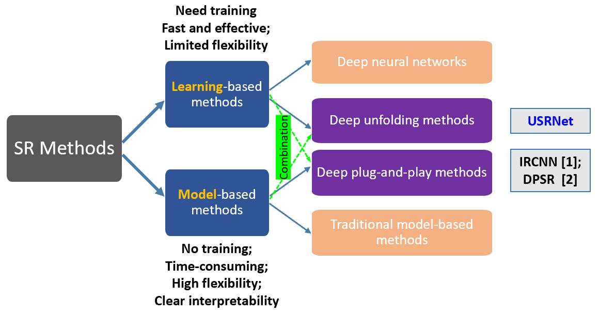

Learning-based single image super-resolution (SISR)
methods are continuously showing superior effectiveness
and efficiency over traditional model-based methods, largely
due to the end-to-end training. However, different from
model-based methods that can handle the SISR problem
with different scale factors, blur kernels and noise levels
under a unified MAP (maximum a posteriori) framework,
learning-based methods (e.g., SRMD [3]) generally lack such flexibility.

```
[1] "Learning deep CNN denoiser prior for image restoration." CVPR, 2017.
[2] "Deep plug-and-play super-resolution for arbitrary blur kernels." CVPR, 2019.
[3] "Learning a single convolutional super-resolution network for multiple degradations." CVPR, 2018.
```

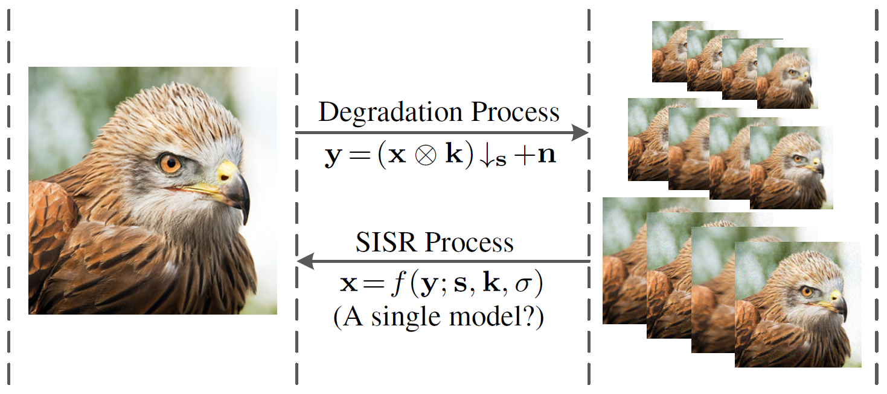


While the classical degradation model can result in various LR images for an HR image, with different blur kernels, scale factors and noise, the study of learning *`a single end-to-end trained deep model`* to invert all such LR images to HR image is still lacking.


**_This work focuses on `non-blind SISR` which assumes the LR image, scale factor, blur kernel and noise level are known beforehand. In fact, non-blind SISR is still an active research direction._**  
* _First, the blur kernel and noise level can be estimated, or are known based on other information (e.g.,
camera setting)._
* _Second, users can control the preference of sharpness and smoothness by tuning the blur kernel and
noise level._ 
* _Third, non-blind SISR can be an intermediate step towards solving blind SISR._


Unfolding algorithm
----------
By unfolding the MAP inference via a half-quadratic splitting
algorithm, a fixed number of iterations consisting of alternately solving a `data subproblem` and a `prior subproblem`
can be obtained.

#TODO


Deep unfolding SR network
----------
We proposes an end-to-end trainable unfolding network which leverages both learning-based
methods and model-based methods. 
USRNet inherits the `flexibility of model-based methods` to super-resolve
blurry, noisy images for different scale factors via `a single
model`, while maintaining the `advantages of learning-based methods`.

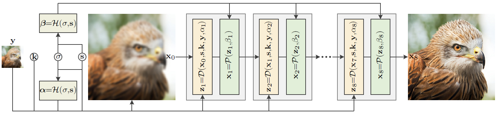 

The overall architecture of the proposed USRNet with 8 iterations. USRNet can flexibly handle the classical degradation
via `a single model` as it takes the LR image, scale factor, blur kernel and noise level as input. Specifically, USRNet consists of three main modules, including the _**data module D**_ that makes HR estimation clearer, the _**prior module P**_ that makes HR estimation cleaner, and the _**hyper-parameter module H**_ that controls the outputs of _**D**_ and _**P**_.

* **_Data module D:_** _closed-form solution for the data term; contains no trainable parameters_
* **_Prior module P:_** _ResUNet denoiser for the prior term_
* **_Hyper-parameter module H:_** _MLP for the hyper-parameter; acts as a slide bar to control the outputs of **D** and **P**_


Models
----------

|Model|# iters|# params|ResUNet|
|---|:--:|:---:|:---:|
|[USRNet](https://drive.google.com/file/d/1qz8aaYOAMhoKn07VppFjRsDflYpxeVmz/view?usp=sharing)     | 8 | 17.02M |64-128-256-512|
|[USRGAN](https://drive.google.com/file/d/1R5HKJzHJmou-3iUYd4cNLSyMeWXSOmD4/view?usp=sharing)     | 8 | 17.02M |64-128-256-512|
|[USRNet-tiny](https://drive.google.com/file/d/1xPN26OW5YBN9-5QfK2BGnaovSutH7fLX/view?usp=sharing)| 6 | 0.59M  |16-32-64-64   |
|[USRGAN-tiny](https://drive.google.com/file/d/1U4BV42Qf0dtBOVbhUNRay6di3j_ioZVM/view?usp=sharing)| 6 | 0.59M  |16-32-64-64   |


Codes
----------

* [main_test_table1.py](main_test_table1.py):  _Code to produce the results in Table 1_
* [main_test_bicubic.py](main_test_bicubic.py):  _Code to super-resolve LR images by bicubic degradation and produce the results in Table 2_
* [main_test_realapplication.py](main_test_realapplication.py):  _Code to super-resolve real LR images_


Blur kernels
----------

|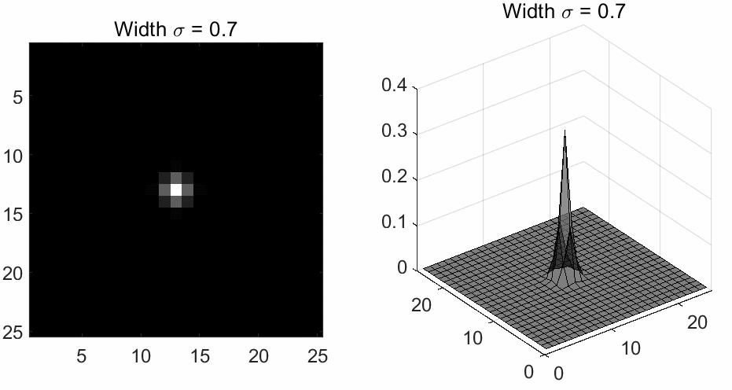|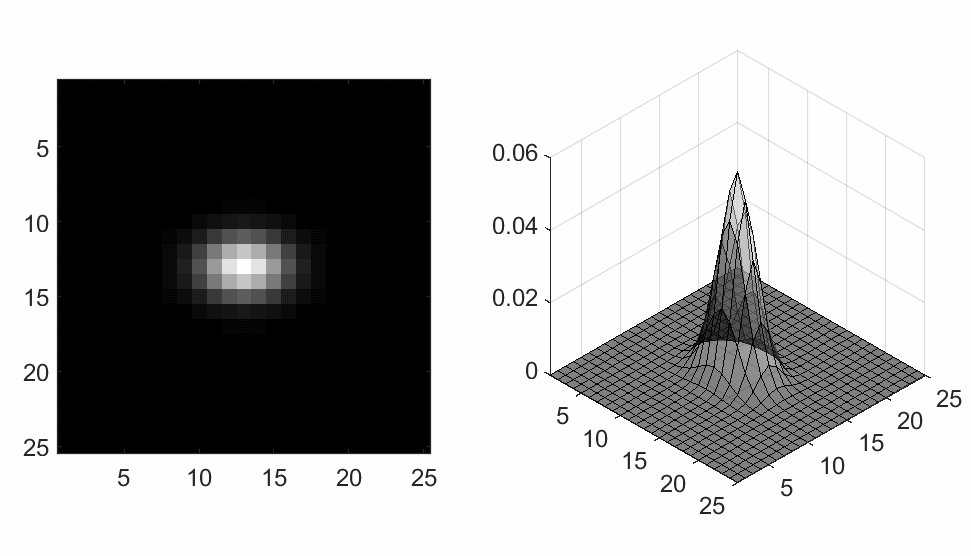|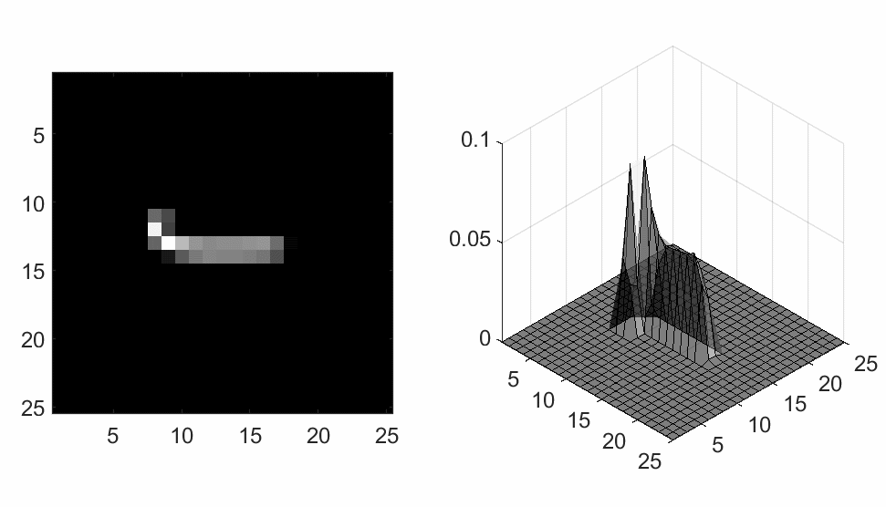|
|:---:|:---:|:---:|
|<i>(a) Isotropic Gaussian kernels</i>|<i>(b) Anisotropic Gaussian kernels</i>|<i>(c) Motion blur kernels</i>|

While it has been pointed out that anisotropic Gaussian kernels are enough for SISR task, the SISR method that
can handle more complex blur kernels would be a preferred choice in real applications.


Approximated bicubic kernel under classical SR degradation model assumption
----------

|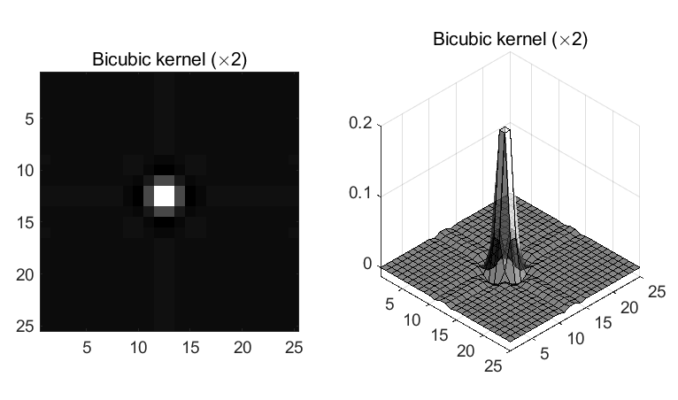||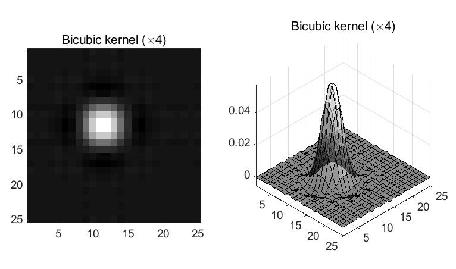|
|:---:|:---:|:---:|
|<i>(a) [Bicubic kernel](kernels/kernels_bicubicx234.mat) (x2)</i>|<i>(b) [Bicubic kernel](kernels/kernels_bicubicx234.mat) (x3)</i>|<i>(c) [Bicubic kernel](kernels/kernels_bicubicx234.mat) (x4)</i>|

The bicubic degradation can be approximated by setting a proper blur kernel for the classical degradation. Note that the bicubic kernels contain negative values.


PSNR results
-----------

Run [main_test_table1.py](main_test_table1.py) to produce the following results.

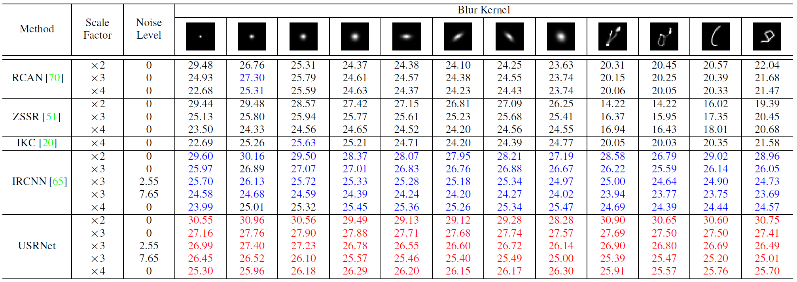  
The table shows the average PSNR(dB) results of different methods for different combinations of scale factors, blur kernels and noise levels.


Visual results of USRNet
----------


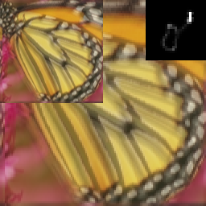  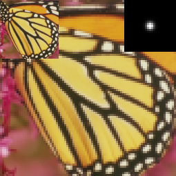  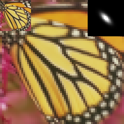
<p align="center"><i>(a) LR images with scale factors 2, 3 and 4</i></p>


  
<p align="center"><i>(b) Results by the single USRNet model with s = 2, 3 and 4</i></p>


Visual results of USRGAN
----------

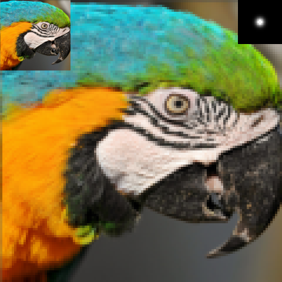  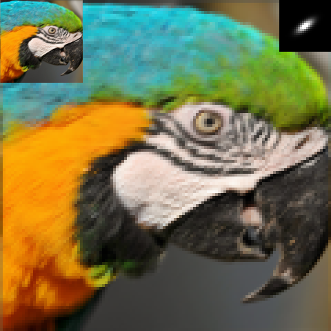  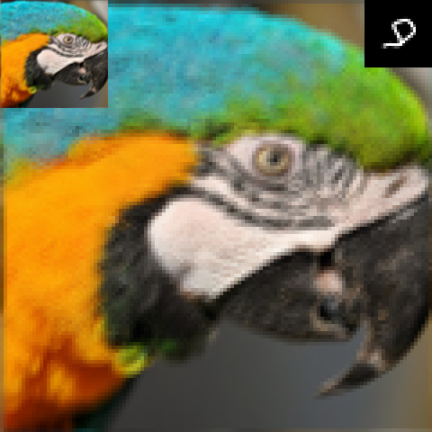
<p align="center"><i>(a) LR images</i></p>


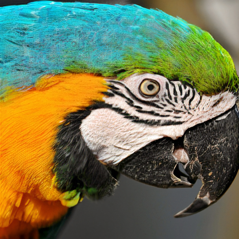  
<p align="center"><i>(b) Results by USRGAN(x4)</i></p>


|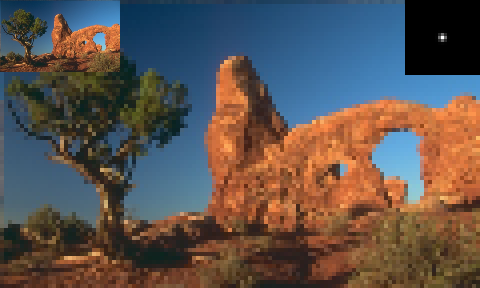 | 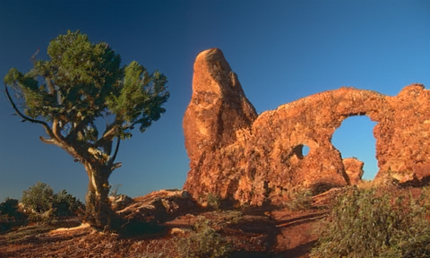 |
|:---:|:---:|
| | 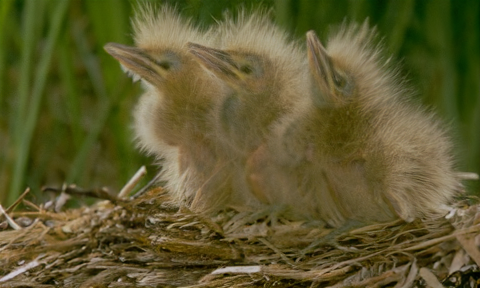 |
|| |
|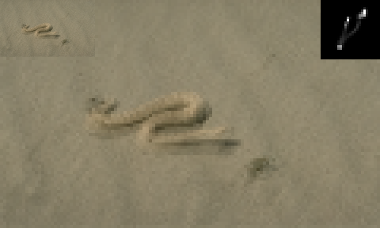| 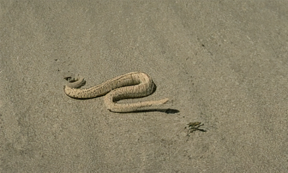|
|<i>(a) LR images</i>|<i>(b) Results by USRGAN(x4)</i>|


Results for bicubic degradation
----------

Run [main_test_bicubic.py](main_test_bicubic.py) to produce the following results.

By taking the approximated bicubic blur kernel as input, USRNet and USRGAN achieve very promising results for bicubic degradation. Note that the bicubic kernels are not adopted in training.

* PSNR results of USRNet for bicubic degradation

| Model |  Scale factor | Set5 | Set14 | BSD100 | Urban100 |
|---|:---:|:---:|:---:|:---:|:---:|
|       | x2 |  37.72  | 33.49  |  32.10  | 31.79  |
|USRNet | x3 |  34.45  | 30.51  |  29.18  | 28.38  |
|       | x4 |  32.45  | 28.83  |  27.69  | 26.44  |

* Visual results of USRGAN for bicubic degradation

 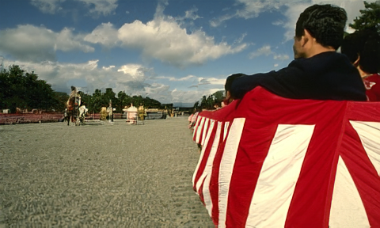 

  

  

<i>(a) LR images via bicubic degradation</i>; <i>(b) results by USRGAN(x4)</i>


Results for deblurring
----------

By setting the scale factor to 1, USRNet can handle deblurring problem.

|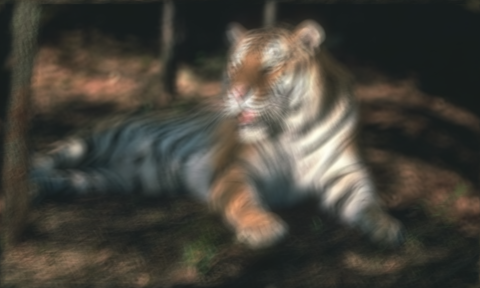 |  |
|:---:|:---:|
|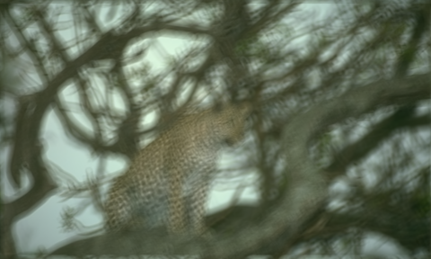 | 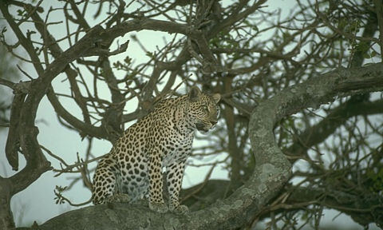 |
|<i>(a) Blurry images</i>|<i>(b) Results by USRNet(x1)</i>|


Generalizability
----------

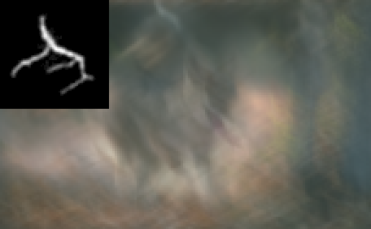 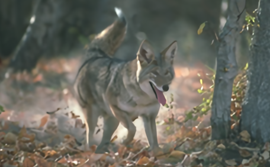 

<i>(a) LR image with kernel size 67x67; (b) result by USRNet(x3)</i>

_**Even trained with kernel size 25x25, USRNet generalizes well to much larger kernel size.**_

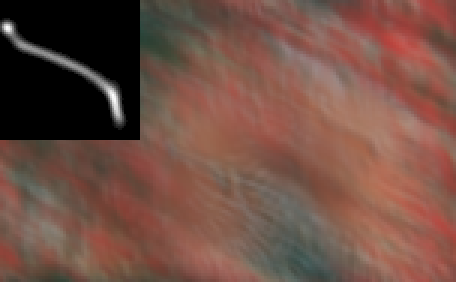 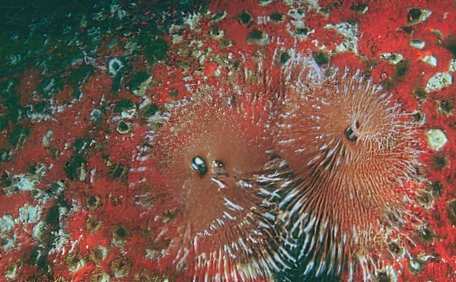 

<i>(a) LR image with kernel size 70x70; (b) result by USRGAN(x3)</i>  

_**Even trained with kernel size 25x25 and scale factor 4, USRGAN generalizes well to much larger kernel size and another scale factor 3.**_


Real image SR
----------

Run [main_test_realapplication.py](main_test_realapplication.py) to produce the following results.

| 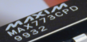|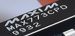 | | |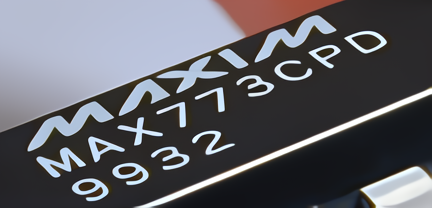|
|:---:|:---:|:---:|:---:|:---:|
|<i>LR</i>|<i>USRNet(x1)</i>|<i>USRNet(x2)</i>|<i>USRNet(x3)</i>|<i>USRNet(x4)</i>|

The above results are obtained via `a single USRNet model` by setting different scale factors (x1, x2, x3, x4) and Gaussian blur kernels (with width 0.6, 0.9, 1.7, 2.2).

| ||
|:---:|:---:|
|<i>Zoomed real LR image Butterfly, 256x256</i>|<i>Result by USRNet(x2), 512x512</i>|

||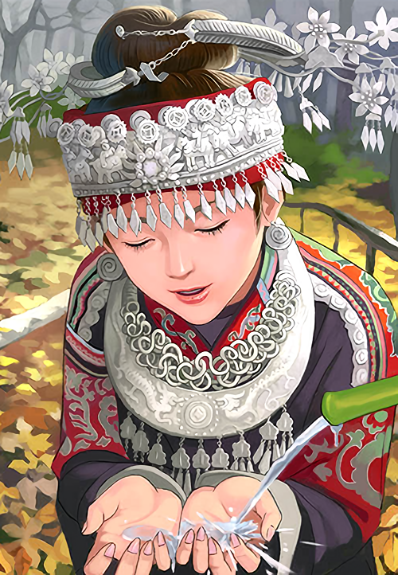| 
|:---:|:---:|
|<i>Zoomed real LR image Comic, 250x361</i>|<i>Result by USRNet(x2), 500x722</i>|


Citation
----------
```BibTex
@inproceedings{zhang2020deep, % USRNet
  title={Deep unfolding network for image super-resolution},
  author={Zhang, Kai and Van Gool, Luc and Timofte, Radu},
  booktitle={IEEE Conference on Computer Vision and Pattern Recognition},
  pages={3217--3226},
  year={2020}
}
```
