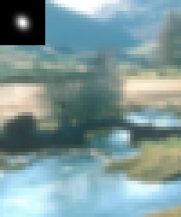
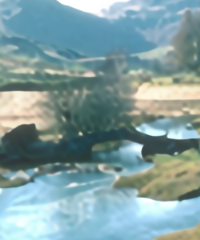
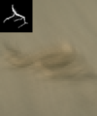
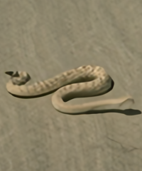
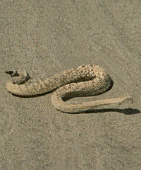
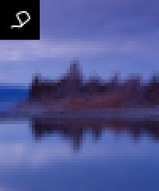
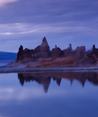
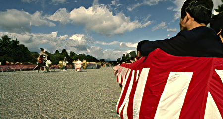
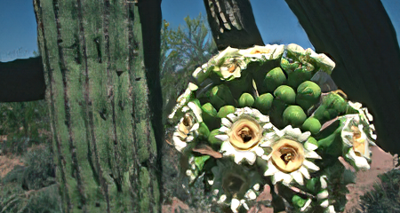
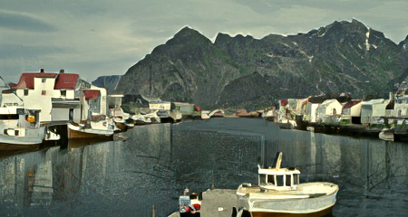

# Deep unfolding network for image super-resolution
Kai Zhang, [Luc Van Gool](https://vision.ee.ethz.ch/people-details.OTAyMzM=.TGlzdC8zMjQ4LC0xOTcxNDY1MTc4.html), [Radu Timofte](http://people.ee.ethz.ch/~timofter/)  
_[Computer Vision Lab](https://vision.ee.ethz.ch/the-institute.html), ETH Zurich, Switzerland_

[paper]

___________

* [Classical SISR degradation model](#classical-sisr-degradation-model)
* [Motivation](#motivation)
* [Unfolding algorithm](#unfolding-algorithm)
* [Deep unfolding SR network](#deep-unfolding-sr-network)
* [Models](#models)
* [Codes](#codes)
* [Blur kernels](#blur-kernels)
* [Approximated bicubic kernel under classical SR degradation model assumption](#approximated-bicubic-kernel-under-classical-sr-degradation-model-assumption)
* [Visual results](#visual-results)
* [Results on bicubicly degradated LR images](#results-on-bicubicly-degradated-lr-images)
* [Generalizability](#generalizability)
* [Real image SR](#real-image-sr)
* [References](#references)

Classical SISR degradation model
----------
 

```
Note: The above degradation model turns into a special case for deblurring when s=1.
```

Motivation
----------


Learning-based single image super-resolution (SISR)
methods are continuously showing superior effectiveness
and efficiency over traditional model-based methods, largely
due to the end-to-end training. However, different from
model-based methods that can handle the SISR problem
with different scale factors, blur kernels and noise levels
under a unified MAP (maximum a posteriori) framework,
learning-based methods (e.g., SRMD [3]) generally lack such flexibility.

```
[1] "Learning deep CNN denoiser prior for image restoration." CVPR, 2017.
[2] "Deep plug-and-play super-resolution for arbitrary blur kernels." CVPR, 2019.
[3] "Learning a single convolutional super-resolution network for multiple degradations." CVPR, 2018.
```


While the classical degradation model can result in various LR images for an HR image, with different blur kernels, scale factors and noise, the study of learning *`a single end-to-end trained deep model`* to invert all such LR images to HR image is still lacking.


**_This work focuses on `non-blind SISR` which assumes the LR image, scale factor, blur kernel and noise level are known beforehand. In fact, non-blind SISR is still an active research direction._**  
* _First, the blur kernel and noise level can be estimated, or are known based on other information (e.g.,
camera setting)._
* _Second, users can control the preference of sharpness and smoothness by tuning the blur kernel and
noise level._ 
* _Third, non-blind SISR can be an intermediate step towards solving blind SISR._


Unfolding algorithm
----------
By unfolding the MAP inference via a half-quadratic splitting
algorithm, a fixed number of iterations consisting of alternately solving a `data subproblem` and a `prior subproblem`
can be obtained.

#TODO

Deep unfolding SR network
----------
We proposes an end-to-end trainable unfolding network which leverages both learning-based
methods and model-based methods. 


USRNet inherits the `flexibility of model-based methods` to super-resolve
blurry, noisy images for different scale factors via `a single
model`, while maintaining the `advantages of learning-based methods`.

#TODO

Models
----------

- USRNet

- USRGAN

- USRNet-tiny

Codes
----------
#TODO

Blur kernels
----------
* **Isotropic Gaussian kernels**
 

* **Anisotropic Gaussian kernels**
 

* **Motion blur kernels**
 

While it has been pointed out that anisotropic Gaussian kernels are enough for SISR task, the SISR method that
can handle more complex blur kernels would be a preferred choice in real applications.


Approximated bicubic kernel under classical SR degradation model assumption
----------
 
 


Visual results
----------
   

   

   

From left to right: `LR image`; `result of USRNet(x4)`; `result of USRGAN(x4)`


Results on bicubicly degradated LR images
----------
  

  

  

From left to right: `LR image`; `result of USRGAN(x4)`


Generalizability
----------
  

`(a) Result of USRNet(x3) for kernel size 67x67`  
Even trained with kernel size 25x25, USRNet generalizes well to much larger kernel size.

  

`(b) Result of USRGAN(x3) for kernel size 70x70`  
Even trained with kernel size 25x25 and scale factor 4, USRGAN generalizes well to much larger kernel size and another scale factor 3.

Real image SR
----------
 `LR image, 108x52`

 `USRNet(x1), deblurring, 108x52`

 `USRNet(x2), 216x104`

 `USRNet(x3), 324x156`

 `USRNet(x4), 432x208`

 `USRNet(x5), 540x260`

 `Zoomed LR image`

The above results are obtained via `a single USRNet model` by setting different scale factors (x1, x2, x3, x4, x5) and Gaussian blur kernels (with width 0.6, 1.0, 1.8, 2.4, 3).

 

From left to right: `Zoomed real LR image Butterfly, 256x256`; `USRNet(x3), 768x768`

  

From left to right: `Zoomed real LR image Comic, 250x361`; `USRNet(x2), 500x722`

References
----------
```
@inproceedings{zhang2020deep, % USRNet
  title={Deep unfolding network for image super-resolution},
  author={Zhang, Kai and Van Gool, Luc and Timofte, Radu},
  booktitle={IEEE Conference on Computer Vision and Pattern Recognition},
  pages={0--0},
  year={2020}
}

```
